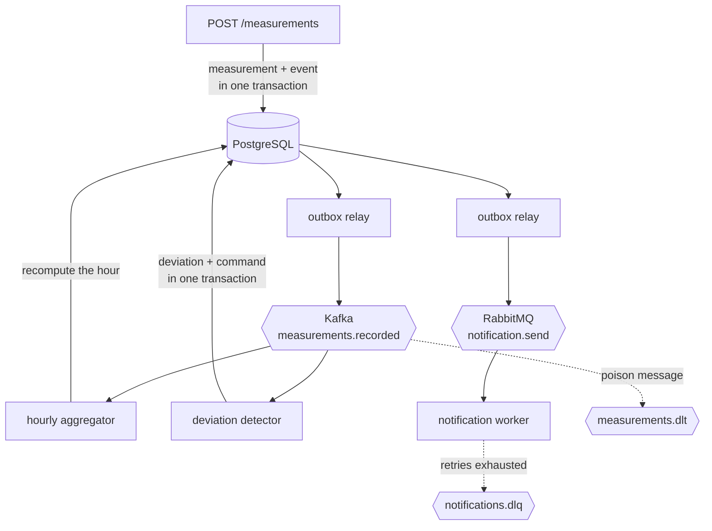

# Gas metering: asynchronous core

Event streaming on Kafka and command processing on RabbitMQ for a gas metering
and reconciliation system, implemented against a systems-analysis specification
written for the same domain.

Measurements arrive from metering nodes, are aggregated hourly, checked against
the contractual daily nomination, and — when the accumulated deviation crosses
the agreed threshold — trigger a notification to the counterparty within three
minutes.

## Why two brokers

The system carries two kinds of traffic, and they want different things.

**Events go to Kafka.** Measurements arrive continuously, order matters per
metering node, several independent consumers need the same stream, and a new
consumer must be able to replay history. Messages are partitioned by node id,
which gives strict ordering per node and parallelism across nodes.

**Commands go to RabbitMQ.** A notification has exactly one executor and a
lifecycle: delivered, retried, or abandoned for manual handling. That needs
per-message acknowledgement, delayed retries and a dead letter queue — none of
which a log-based broker provides.

Full reasoning in [ADR-006](docs/adr/0006-kafka-and-rabbitmq.md).

## Flow



## Delivery guarantees

Delivery is **at-least-once** everywhere, and every consumer is idempotent.

A database write and a broker publish cannot share one transaction, so the
transactional outbox pattern is used on both sides: the business row and its
message are written to PostgreSQL together, and a relay publishes them
afterwards. A crash between publishing and marking the row produces a duplicate,
never a loss — duplicates are detectable and repairable, losses are neither.

Duplicates are absorbed in two different ways:

- **By construction.** The hourly aggregate is recomputed from scratch rather
  than incremented, so processing the same measurement twice changes nothing.
  This also lets late archive data correct an hour that was already published.
- **By deduplication.** Sending a notification cannot be made idempotent — two
  emails are two emails — so the worker checks whether the notification was
  already sent before sending it.

## Failure handling

| Failure | Kafka | RabbitMQ |
|---|---|---|
| Transient error | Offset not committed, message redelivered | Rejected without requeue, returns after a TTL |
| Retry counter | Kept by the consumer, keyed by partition and offset | Kept by the broker in the `x-death` header |
| Permanent failure | Published to `measurements.dlt`, offset committed past it | Routed to `notifications.dlq` |
| Blast radius | The whole partition stalls until the message is parked | The single message only |

Kafka has no notion of a message lifecycle, so the same outcome is assembled by
hand. The difference in blast radius is the reason it matters: a permanently
failing message blocks every message behind it in its partition until the
consumer parks it explicitly.

## Running it

```
docker compose up -d
docker compose exec postgres psql -U gas -d gas_metering -f /db/migrations/0001_core_schema.sql
docker compose exec kafka /opt/kafka/bin/kafka-topics.sh --bootstrap-server localhost:9092 --create --topic measurements.recorded --partitions 6 --replication-factor 1
python services/rabbit/topology.py
```

| Interface | Address |
|---|---|
| API docs | http://localhost:8000/docs |
| Kafka UI | http://localhost:8080 |
| RabbitMQ management | http://localhost:15672 |

Tests: `pytest`. Unit tests run standalone; integration tests start PostgreSQL
in a container through testcontainers.

## What the implementation revealed about the specification

The specification was written first, in full, and implementing it exposed
defects that survived review as prose:

- **One threshold, two comparisons.** FR-07 and FR-22 share a single materiality
  threshold, but the dispatcher alarm compares an instantaneous flow rate while
  the counterparty notification compares volume accumulated since the start of
  the gas day. A shared threshold cannot serve both.
- **Flapping is undefined.** Nothing in the specification says what happens when
  the flow hovers around the threshold, which as written produces a notification
  per measurement.
- **FR-16 is narrower than its scenario.** It requires archive re-reads without
  loss or duplication but says nothing about the archive returning a *different*
  value for a timestamp already recorded.
- **Units are never stated.** Standard conditions are defined, but the unit of
  flow itself is not.

## Deliberate simplifications

- Consumers read the same database the API writes to. Separate services would
  own separate stores; a second database was not worth the study value.
- The intra-day delivery profile is treated as linear. A real contract carries
  an hourly curve.
- Notification sending is simulated. The interesting part is the guarantees
  around it, not the transport.
- One broker instance, replication factor 1. Production would run three.
- A residual gap remains between sending a notification and recording it.
  Closing it requires an idempotency key honoured by the receiving gateway.