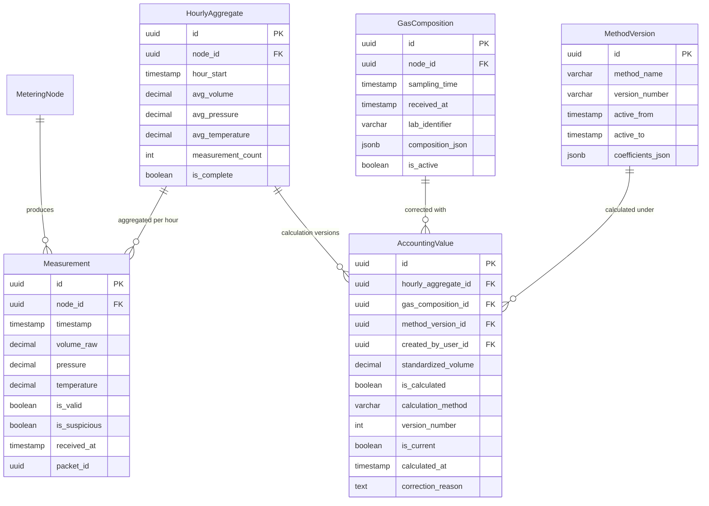

# ER model: measurement and accounting

The two data layers of [ADR-001](../adr/0001-two-data-layers.md). `Measurement`
and `HourlyAggregate` form the operational layer; `AccountingValue` is the
accounting layer, and it exists only once a `GasComposition` and a
`MethodVersion` are available to correct the volume with.

## Notes

`MethodVersion.active_to` is NULL on the version currently in force. Validity
periods do not overlap: exactly one version of the reference data is active at
any moment. The constraint is enforced in the implementation and is not
expressible in the schema.

`GasComposition.is_active` means the chromatogram is fit to be used in
calculations. When a refined analysis arrives for the same sampling period, the
previous record is set to `is_active = false` but stays in the database. This is
not the same as the versioning on `AccountingValue`: there it is the result of a
calculation that is versioned, here it is the fitness of the laboratory inputs.

`AccountingValue` carries both `version_number` and `is_current`, which is how
FR-12 is met: a correction adds a version rather than overwriting one.
