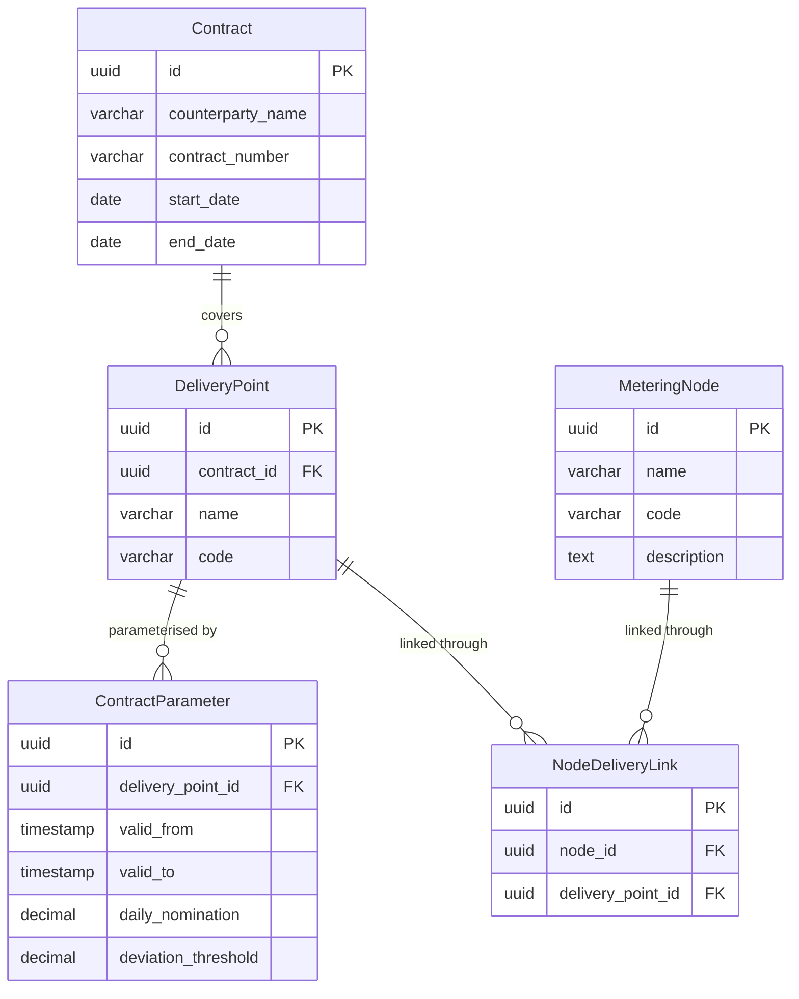

# ER model: contracts and delivery points

The contract reference data. Nominations and deviation thresholds live here, in
`ContractParameter`, which is what FR-07 means by "the threshold value held in
the contract reference data".

## Notes

`NodeDeliveryLink` resolves a many-to-many relationship: one metering node can
serve several delivery points and one delivery point can be fed by several nodes.
This is why `Deviation` holds both `node_id` and `delivery_point_id` explicitly
rather than deriving one from the other.

`ContractParameter` is valid over an interval (`valid_from`, `valid_to`) rather
than being tied to a single gas day. A change of nomination closes the current
row and opens a new one, so the parameter in force at any past moment stays
recoverable — the same approach as `MethodVersion`.

Per the MVP assumptions, these rows are loaded as reference data and are not
editable through the interface (FR-30).
