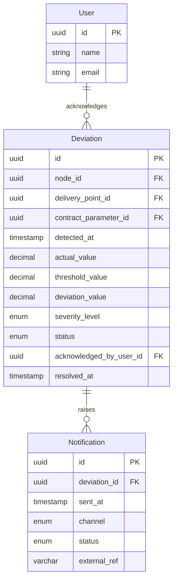

# ER model: deviations and notifications

What FR-07 records and what FR-22 sends. This block and the two above it are the
part of the model the implementation in this repository covers.

## Notes

`Deviation` holds `node_id` and `delivery_point_id` at the same time,
deliberately. The link between a metering node and a delivery point
(`NodeDeliveryLink`) is many-to-many, so the delivery point cannot be derived
from the node unambiguously and both references are stored explicitly. This is
not a normalisation failure but a consequence of the relationship.

`contract_parameter_id` records which version of the contract parameters the
deviation was judged against. Without it, a later change of nomination would make
a past deviation look wrong.

`Notification.external_ref` holds the identifier returned by the delivery gateway
— the piece that would let the system reconcile its own record against the
provider's, and the natural place to put an idempotency key (see
[ADR-008](../adr/0008-delivery-guarantees.md)).
