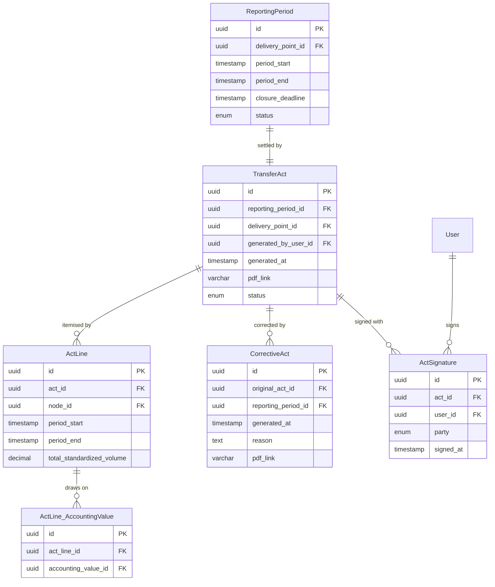

# ER model: documents

The reporting period, the transfer act and its signatures. The structure follows
[ADR-002](../adr/0002-period-closing.md): a corrective act is a separate document
linked to the original, never a modification of it.

## Notes

`ActSignature`: the pair (`act_id`, `party`) is unique — a second signature by
the same party is rejected. See UC-25, alternative scenario, and the 409 response
on `POST /acts/{actId}/signatures`. An act moves to "signed" only once both
signatures are present, and the order of signing is not fixed.

`TransferAct.status` takes the values `draft` (produced), `ready_for_signing`,
`signed` (by both parties), `disagreement` (a party refused to sign and a
protocol of disagreement is drawn up outside the system), and `closed` (the
period is closed and changes are forbidden).

`ReportingPeriod.closure_deadline` is the T + 10 working days of FR-17. It is
stored rather than computed so that the deadline an act was subject to stays
recoverable if the rule ever changes.

`ActLine_AccountingValue` resolves a many-to-many relationship and is what makes
FR-27 possible: every line of an act can be traced back to the individual
accounting values it was built from, and from there to their method versions and
inputs.

`User` appears here in abbreviated form; it is described fully in
[05-access-and-audit.md](05-access-and-audit.md).
