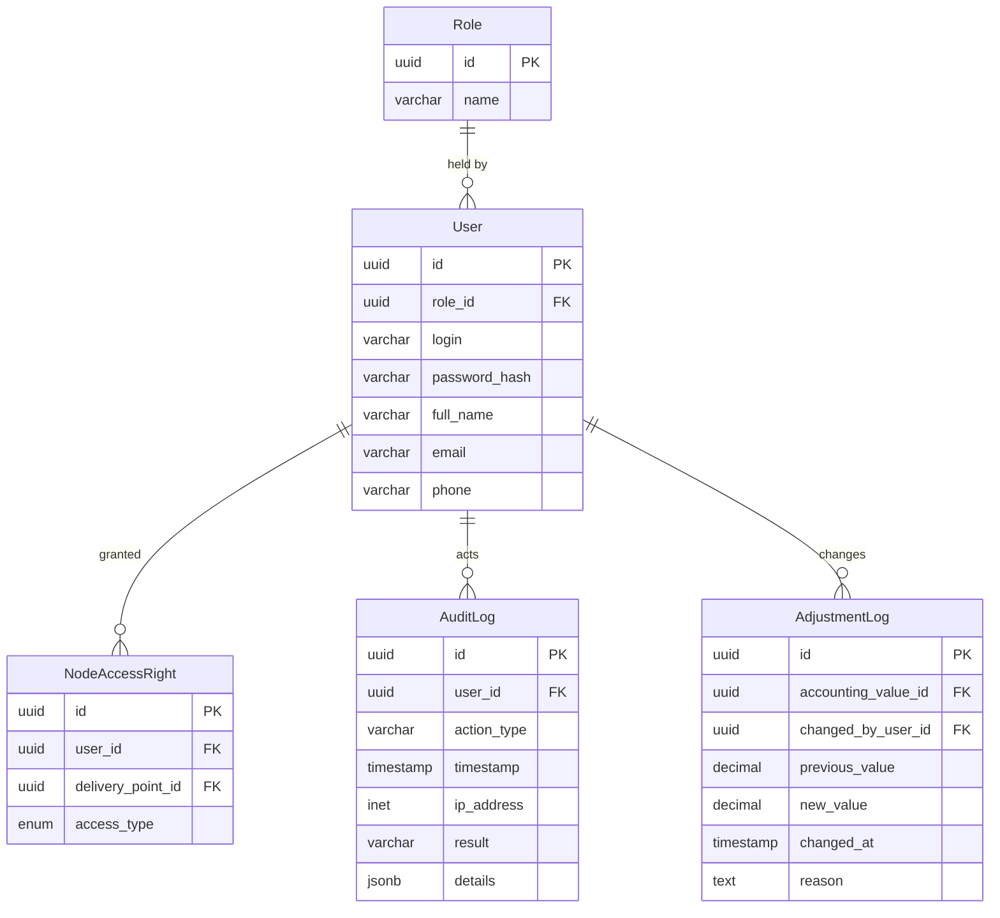

# ER model: access and audit

Who may see what, and what was done. This block carries NFR-12 (the counterparty
sees only its own delivery point) and FR-13 (an immutable record of every change
to accounting data).

## Notes

`NodeAccessRight` binds a user to a delivery point rather than to a metering
node, despite its name. That is what NFR-12 requires: the counterparty's access
is defined by the delivery point named in its contract, and the nodes follow from
`NodeDeliveryLink`.

`AdjustmentLog` is what makes FR-13 checkable. It holds both the previous and the
new value and the grounds for the change: without "before and after" there is no
audit, and without grounds a correction looks arbitrary. It is append-only and
retained for five years (NFR-11).

`AuditLog` covers user actions in general — sign-in, viewing, exports — while
`AdjustmentLog` covers changes to accounting values specifically. They are kept
apart because they are read by different people for different reasons: the
administrator investigates incidents, the counterparty verifies figures.

`AuditLog.result` records whether the action succeeded or was refused, so a
sequence of refused attempts is visible as such.
