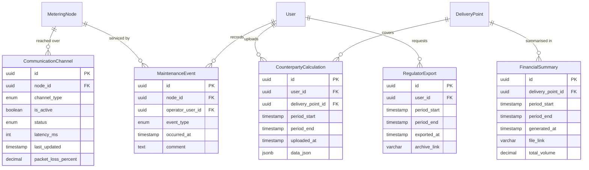

# ER model: infrastructure and integrations

What IT operations watches (FR-31), and the artefacts the outward-facing
use cases produce: the counterparty's uploaded calculations, the regulator's
export, the financial summary.

## Notes

`CommunicationChannel` is per node and there may be several, which is what
[ADR-005](../adr/0005-connection-loss.md) means by redundant channels: the
consequence of showing a frozen value during an outage is offset by having more
than one route to the node.

`latency_ms` and `packet_loss_percent` are the figures FR-31 puts on the
operations dashboard, and they are what NFR-7 is measured against — raw
measurements reaching central storage within five minutes of the hour closing.

`RegulatorExport` records the export itself, not just its result. UC-24 requires
this: who asked for what data and when is itself auditable information.

`MaintenanceEvent` covers FR-25 — instrument replacement, calibration, manual
entry of readings during incidents — and is why a gap in measurements can be
explained rather than merely observed.

`User`, `MeteringNode` and `DeliveryPoint` appear here in abbreviated form and
are described fully in their own blocks.
