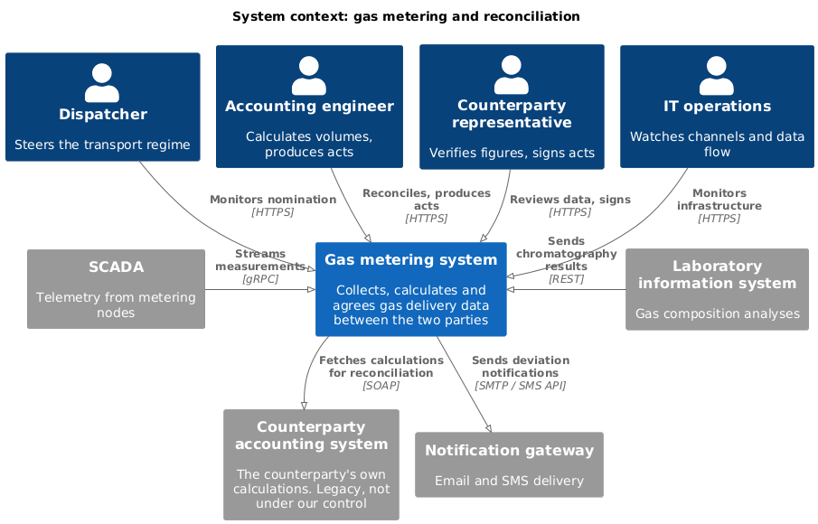
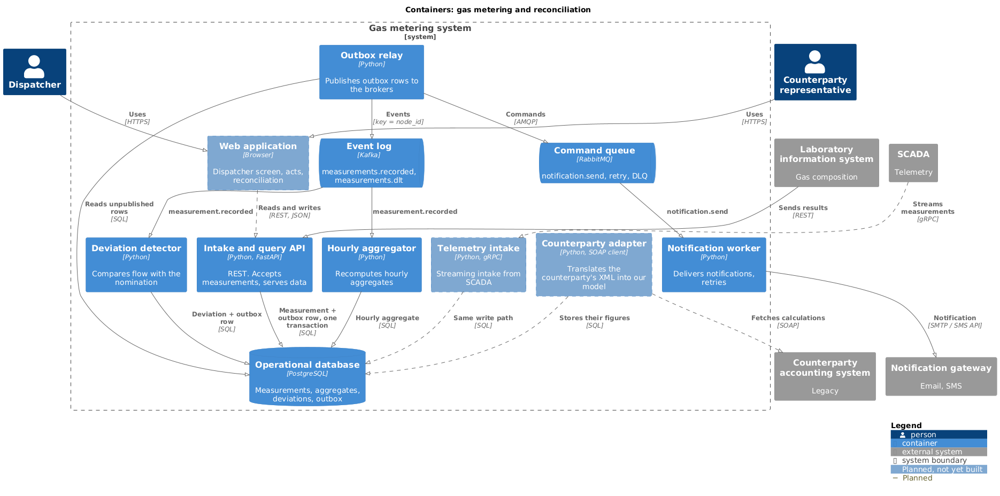
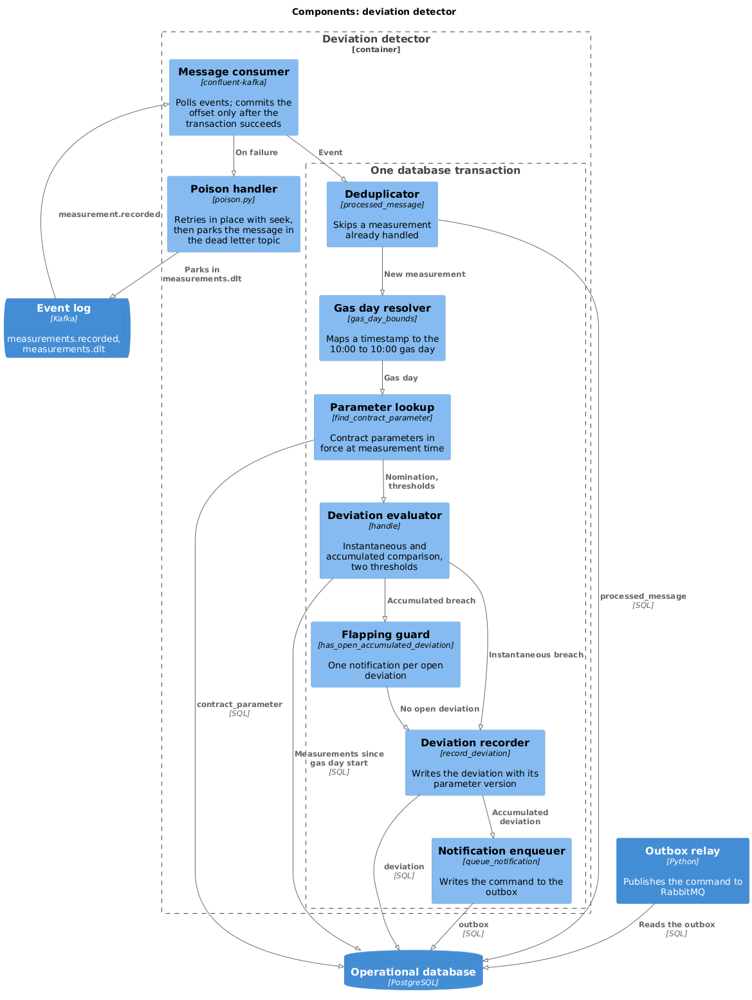

# Architecture: C4 model

The system at three levels of zoom. Each level answers one question for one
audience, and each is a closer view of the previous one rather than a new
drawing: what sits outside the boundary stays where it was.

Elements drawn dashed are planned and not yet built: the web interface, the gRPC
telemetry intake and the SOAP adapter to the counterparty's system. The rest
exists in this repository.

Sources are C4-PlantUML in [src](src); see the [README](README.md) for how to
regenerate the images.

## Level 1 — System context

*Who uses the system, and which systems it talks to.* For business stakeholders.

Four of the eight roles are shown; the financial controller, administrator,
laboratory technician and regulator are left out for readability, and are all in
the [use cases](../use-cases/README.md).

The three protocols on this diagram are each chosen by who is on the other side:

- **HTTPS / REST** where the other side is a person or a system we integrate with
  on equal terms — the web interface, the laboratory system.
- **gRPC** where the other side is a machine sending a continuous stream — SCADA.
  Chosen for throughput and streaming, which an archive re-read after an outage
  needs (NFR-6: 72 hours of readings within 15 minutes).
- **SOAP** where the other side is a legacy system we do not control — the
  counterparty's accounting system. Not chosen but imposed; the arrow runs *from*
  us, because that system does not push anything anywhere.

## Level 2 — Containers

*What inside the system runs or stores data separately, and how the parts talk.*
For architects and developers.

A container in C4 is anything separately deployable — an application, a
database, a broker — not a Docker container. Here the two happen to coincide:
each C4 container is also a service in `docker-compose.yml`.

What the diagram makes visible:

- **Brokers are named by role, with the technology in brackets:** an event log
  and a command queue. That is the split in
  [ADR-006](../adr/0006-kafka-and-rabbitmq.md), and it would survive a change of
  technology.
- **The outbox relay is the only container that knows both brokers.** Neither
  the API nor any consumer writes to a broker directly.
- **Nearly everything reaches into one database.** This is the simplification
  recorded in the project README — consumers read the database the API writes to.
  Stated in prose it sounds harmless; drawn, the coupling is plain. In a real
  deployment the aggregator and detector would own their stores.
- **The planned gRPC intake shares the REST API's write path**: measurement and
  outbox row in one transaction. A new protocol at the edge changes nothing
  downstream.

## Level 3 — Components of the deviation detector

*What a single container is made of.* Drawn only for the container where the
logic is — the detector. The others are simple enough that this level would add
nothing.

A component is a grouping of related behaviour behind a boundary, not
necessarily a class or a file. In this service the components are functions in
one module; the diagram shows the logical structure, not the file layout.

The boundary marked *one database transaction* is not standard C4 notation, and
it is the most important thing on the diagram:

- **Seven components run inside it**, from the deduplicator to the notification
  enqueuer, and commit together or not at all.
- **The consumer and the poison handler sit outside it.** The offset is committed
  only after the transaction succeeds — at-least-once delivery from
  [ADR-008](../adr/0008-delivery-guarantees.md). A crash between the two
  redelivers the message, and the first thing inside the boundary is the
  deduplicator, which is why it is first.
- **Two paths reach the deviation recorder.** An instantaneous breach goes
  straight there; an accumulated one passes the flapping guard, and only it goes
  on to the notification enqueuer. That is the finding that FR-07 and FR-22 need
  two thresholds, drawn.
- **The deviation and its notification command are written in the same
  transaction**, so one cannot exist without the other. The outbox relay, outside
  the container, takes it from there. See
  [ADR-007](../adr/0007-outbox-vs-cdc.md).

Level 4, code, is not drawn. C4 treats it as optional and generated from the code
when needed.
