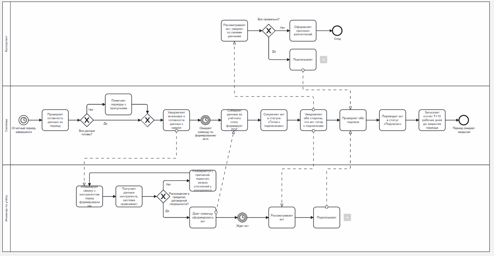

# Process: producing and signing the transfer act

BPMN 2.0. Covers UC-08, UC-10 and UC-25, and ends where
[ADR-002](../adr/0002-period-closing.md) begins: the T + 10 working day count
down to the period closing.

## The flow

**System.** The reporting period ends and the system checks whether the inputs
for the period are complete. Where they are not, it marks the stretches with gaps
and carries on rather than stopping — an act with flagged calculated periods is
more useful than no act. It then notifies the engineer that the data is ready for
reconciliation and waits for the command to produce the act.

On that command it assembles the figures from the accounting layer, generates the
PDF, stores the act as `ready_for_signing` and tells both parties it is waiting
for them.

**Accounting engineer.** Starts the reconciliation against the counterparty
before producing anything. The counterparty's data comes in and the system
compares it. If the discrepancy is outside the contractual tolerance, the
engineer works out why — recalculation, a refinement, a query to the counterparty
— and loops back. Only once the discrepancy is within tolerance does the engineer
give the command to produce the act, wait for it, review it and sign.

**Counterparty.** Reviews the act against its own figures. If they agree, it
signs; if not, it raises a protocol of disagreement and the process ends in
dispute.

The system then checks for both signatures, moves the act to `signed` and starts
the T + 10 working day count.

## Two things the diagram settles

**Reconciliation comes before the act, not after.** The loop back from "sort out
the cause" to "start the reconciliation" is what UC-10 is for: discrepancies are
resolved while the act can still be produced correctly, rather than argued about
once it exists. This is business goal 3 — fewer acts signed with a protocol of
disagreement.

**Signing is parallel.** Both signing tasks hang off the same point and the
system waits for both; neither party waits for the other, and the order is not
fixed. This is why `ActSignature` is unique on the pair (act, party) rather than
carrying a sequence, and why a repeat signature is a 409 rather than an update.

## Not implemented

None of this process is implemented in this repository; it is documents and
interface work. It is included because the asynchronous core feeds it: the
accounting values the act is assembled from, and the deviations the
reconciliation has to explain.
