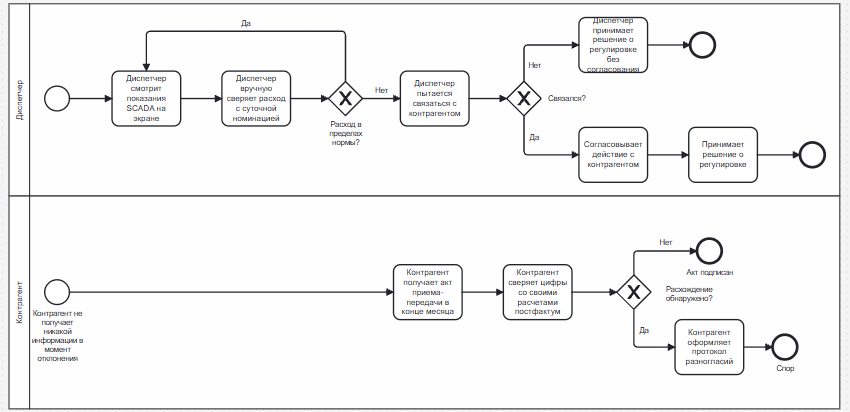
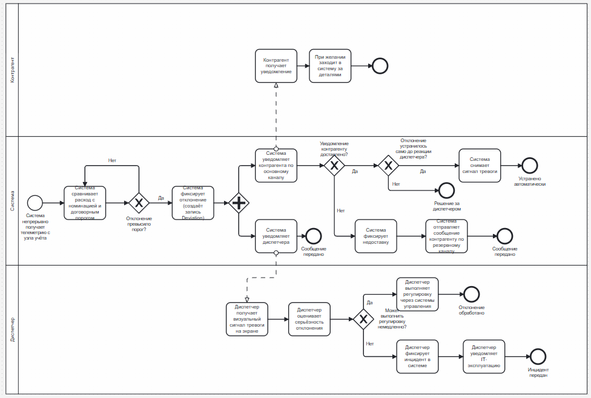

# Process: handling a deviation from the nomination

BPMN 2.0. Two versions of the same process: how it runs today, and how it runs
with the system in place.

## AS-IS

Two pools, and the gap between them is the problem.

**Dispatcher.** Watches SCADA readings on screen, compares flow against the daily
nomination *by hand*, and judges whether it is within tolerance. On a deviation
the dispatcher tries to reach the counterparty. If contact is made, the
adjustment is agreed and then carried out; if not, the dispatcher adjusts the
regime without agreement.

**Counterparty.** Receives no information at the moment of the deviation. It
learns what happened from the transfer act at the end of the month, checks the
figures against its own calculations after the fact, and either signs or raises a
protocol of disagreement.

Three properties of this process are what the system is built to change:

- The comparison against the nomination is manual, so detection depends on
  whether the dispatcher happens to be looking.
- Reaching the counterparty is a separate, slow, human step, and it either delays
  the adjustment or is skipped.
- The counterparty's first sight of a deviation is a month later, when nothing
  can be done about it. Every dispute starts here.

## TO-BE

Three pools: the system takes over the middle.

**System.** Receives telemetry continuously, compares flow against the nomination
and the contractual threshold, and on a breach records a `Deviation`. Then a
parallel gateway — the structural centre of this diagram — splits the flow into
two branches that run at the same time: notify the counterparty over the primary
channel, and raise the dispatcher's alarm.

The notification branch checks delivery. On failure the system records the
non-delivery and sends over the backup channel, which is UC-02's alternative
scenario and NFR-5's three minutes. On success, if the deviation cleared before
the dispatcher reacted, the system withdraws the alarm by itself and logs that it
resolved without intervention.

**Dispatcher.** Sees the alarm, judges the severity, and either adjusts the
regime through the existing control systems or — if the adjustment cannot be made
— records an incident and notifies IT operations.

**Counterparty.** Receives the notification and can open the system for the
detail.

The parallel gateway is [ADR-004](../adr/0004-counterparty-notification.md) made
visible: there is no sequence flow from "notify the counterparty" to "dispatcher
acts", because the whole decision was that the dispatcher does not wait.

## What the implementation covers

The system pool, up to and including delivery of the notification and its
retries. The dispatcher and counterparty pools are interface work and are out of
scope here.

The retry branch in the diagram — "record non-delivery, send over the backup
channel" — is realised in RabbitMQ as a rejection into a delayed retry queue and,
once the budget is spent, a dead letter queue. The diagram draws one fallback;
the implementation gives it a bounded number of attempts and somewhere for the
message to end up when they run out. See
[ADR-006](../adr/0006-kafka-and-rabbitmq.md).
