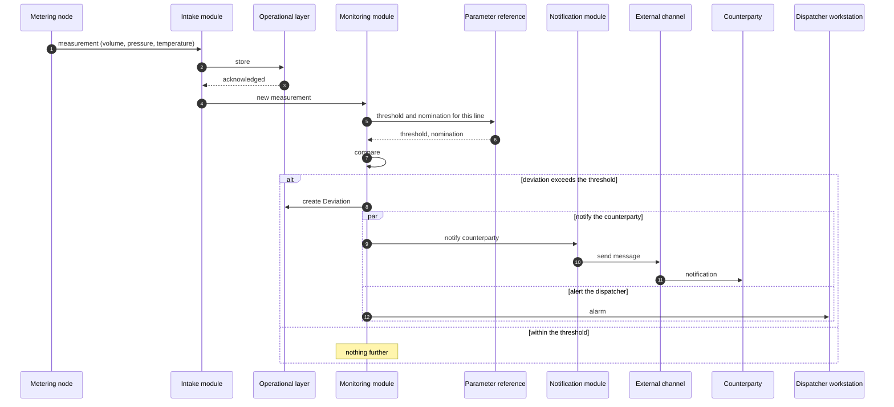
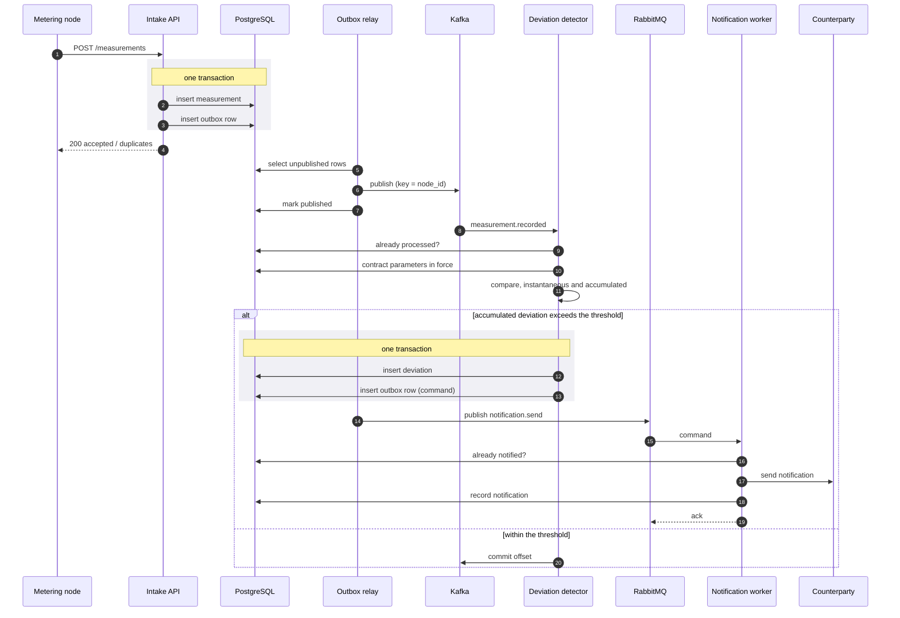

# Sequence: detecting a deviation and notifying the counterparty

The path a single measurement takes from the metering node to the dispatcher's
alarm and the counterparty's notification. This is the flow the services in this
repository implement, and it is where NFR-13 is spent: six minutes end to end.

## As designed

The parallel block is [ADR-004](../adr/0004-counterparty-notification.md) drawn
out: the counterparty is told at the same moment as the dispatcher, not after the
dispatcher has decided what to do. Waiting for agreement would take 15 to 30
minutes against a reaction window of 3 to 5.

The original diagram, before this repository restated it, is in
[export/sequence-deviation-original.png](export/sequence-deviation-original.png).

## As implemented

The design shows modules calling each other directly. The implementation puts
brokers between them, which changes the shape of the flow without changing its
meaning — and adds the guarantees that direct calls do not have.

## What the brokers buy

Three things the direct-call version cannot do, each of which the specification
turns out to need:

**A measurement and its event cannot diverge.** Both writes happen in one
database transaction and the relay publishes afterwards. A direct call would
lose the event if it failed after the measurement was stored. See
[ADR-007](../adr/0007-outbox-vs-cdc.md).

**A failed notification is retried rather than lost.** NFR-5 allows three
minutes, which is enough for several attempts. The worker rejects a failed
message, it waits out a TTL in the retry queue and comes back; after the retry
budget is spent it goes to the dead letter queue for a person to deal with. A
direct call either blocks or drops the notification.

**The monitoring module is not the only consumer.** The hourly aggregator reads
the same Kafka topic as its own consumer group, independently and at its own
pace. This is [ADR-001](../adr/0001-two-data-layers.md) in practice: one primary
source, two independent pipelines.

## Where the six minutes go

| Step | Budget | Requirement |
|---|---|---|
| Measurement reaches the operational layer | 2 min | NFR-1 |
| Deviation recorded | 1 min | FR-07 |
| Notification delivered | 3 min | NFR-5 |
| **End to end** | **6 min** | **NFR-13** |

In the implementation the first two steps take well under a second at this
volume — 50 nodes at one measurement a minute is under one message per second.
The budget exists for the real system, where the channels to remote nodes are
the slow part.
