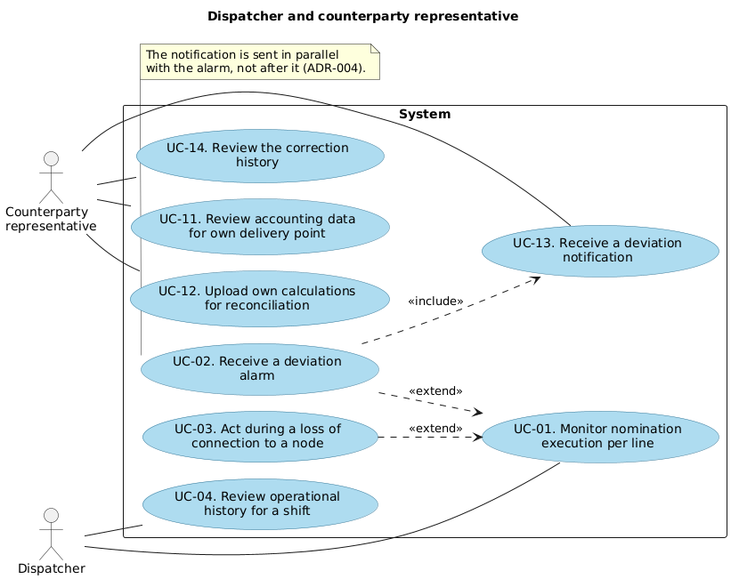
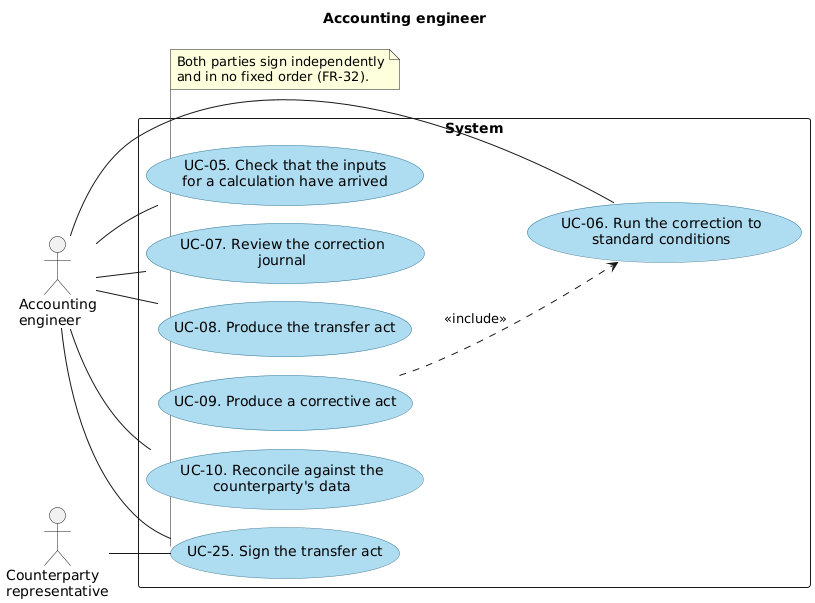
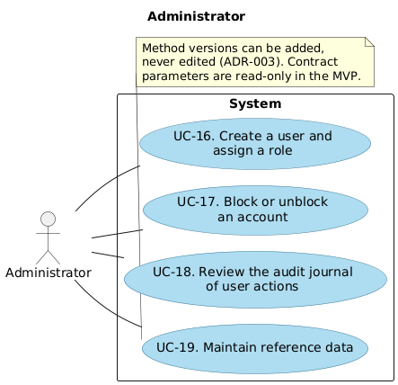
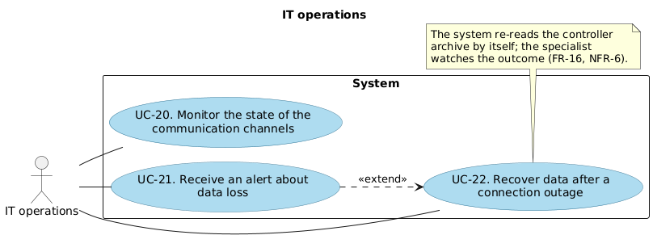
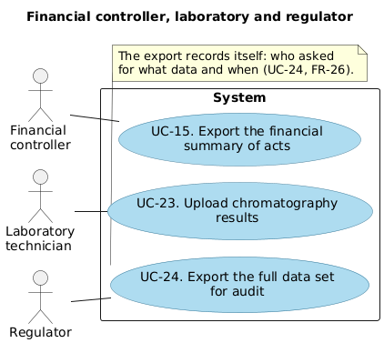

# Use case diagrams

Which role reaches which case, and where cases depend on one another. The cases
themselves are written out in [docs/use-cases](../use-cases/README.md).

Sources are PlantUML in [src](src); see the [README](README.md) for how to
regenerate the images.

## Dispatcher and counterparty representative

Two relationships carry the design here. UC-02 and UC-03 both extend UC-01: the
dispatcher is monitoring, and an alarm or an outage interrupts that. And UC-02
includes UC-13 — raising the alarm *is* notifying the counterparty, in the same
step, which is [ADR-004](../adr/0004-counterparty-notification.md).

## Accounting engineer

UC-09 includes UC-06: producing a corrective act always means recalculating
first, and the recalculation is the same operation as any other, with the added
check that the period is closed.

UC-25 involves both the engineer and the counterparty. It was missing from the
original diagrams and has been added, since FR-32 gives it two actors.

## Administrator

## IT operations

UC-21 extends UC-22: an alert about data loss may or may not lead to a recovery,
depending on whether the connection comes back by itself.

## Financial controller, laboratory and regulator

Three roles with one case each. They touch the system rarely but each needs
something the others do not: the controller needs totals, the laboratory needs to
put data in, and the regulator needs everything at once, reproducibly.
